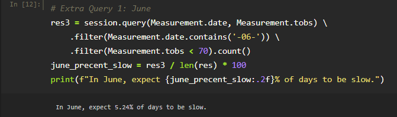

# Surf’s Up with Advanced Data Storage and Retrieval: analyzing weather trends to pick ideal surfing/ice cream shop locations

## Overview
Fictionalized me from the module has decided that my dream retirement gig is opening a shop that sells surfing gear and ice cream in Hawaii (while drinking copious amounts of coffee).  Poorly-named-by-his-parents investor, W. Avy, is willing to financially back this silly idea but has concerns about weather conditions, as a previous surf shop venture he funded failed due to frequent inclement weather.  Thus far, we have addressed the concerns involving constant rain, however, the investor is still concerned about year-round viability.  He would like to compare temperatures in June (peak ice creaming and surfing season) to December to understand whether the shop will turn a profit year-round or if cold weather is likely to make both surfing and ice cream undesirable during the off season.

## Results
### Statistics
**Table 1:** Statistics for temperatures in June.

**Table 2:** Statistics for temperatures in December.

### Major Points
- There is very little difference in the average temperature between June and December (June: ~75 degrees (**Table 1**), December: ~71 degrees (**Table 2**)).
- The minimum temperature for December is noticeably cooler than the minimum temperature in June (June: 64 degrees (**Table 1**), December: 56 degrees (**Table 2**)).
- There is little difference in the percentiles between June and December, with December being 2 to 4 degrees lower in each bracket (**Tables 1-2**).
- The standard deviation in December is greater than in June, suggesting that December weather is more variable (June: ~3.3(**Table 1**), December: ~3.7 (**Table 2**).

## Summary
Overall, it looks like the temperature variance between June and December should not affect business in the cooler months. Hawaiian Decembers are still quite warm, and even though the average temperature and temperatures at the 25, 50, and 75 percentiles and somewhat lower, they are not markedly lower as would be seen in, for example, a Cleveland winter where the average temperature in December is around freezing while the average temperature in June is in the 60s-80s.  This leaves us with the question on how often the somewhat colder temperatures in December will significantly affect business in the shop.  It would be necessary to understand 1) at what temperature most people avoid ice cream because it is too cold out, 2) the relationship between air temperatures and water temperatures, and 3) the water temperature at which surfing is uncomfortable for most surfers to say for sure what days the shop would be unlikely to do business.  In the absence of that data, I will make an exploratory assumption that 70 degrees and greater in air temperature is a level at which people are happy to buy ice cream and go surfing (productive days), but below that temperature they are less willing, so the shop will not do as well (slow days).  Using this threshold, about 5% of the dates in June would be slow days (**Fig S1**) and about 6% of the dates in December would be slow days (**Fig S2**).  This furthers the argument that business in the ice cream/surf shop will not different significantly between June and December.  To further interrogate this data, we should **1)** pick a temperature threshold above which days are expected to be busy (e.g. 85 degrees) and compare the number of busy days in June versus December.  We should also **2)** compare the level of precipitation between June and December to see if there is also more rain in December which would likely lead to slower business days.

**Supplemental Figure 1:** Percentage of “slow” business days in June when assuming that weather under 70 degrees will lead to a slow day.

**Supplemental Table 2:** Percentage of “slow” business days in December when assuming that weather under 70 degrees will lead to a slow day.

